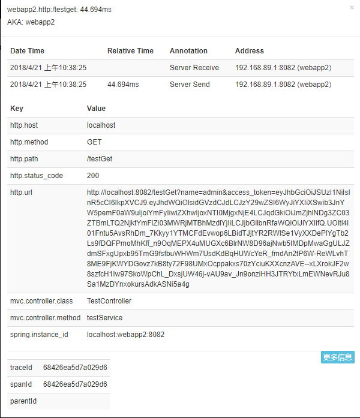

# Feign 声明式服务调用
## 什么是声明式？
声明式就是只需要声明代码表达在哪里（where）和做什么（what），不需要关心怎么做（how），Aspect Oriented Programming(面向切面编程)，
AOP就是一种Declarative Programming(声明式编程)。
与此对应的就是Imperative Programming(命令式编程)，它只需要声明代码表达在哪里（where）和做什么（what）但是要实现怎么做（how）

>Feign是一个声明式的伪Http客户端，它使得写Http客户端变得更简单。使用Feign，只需要创建一个接口并用注解的方式来配置它，即可完成对服
务提供方的接口绑定，简化了在使用Ribbon时自行封装服务调用客户端的开发量。
>
>Feign具有可插拔的注解特性，包括Feign注解和JAX-RS注解，同时也扩展了对SpringMVC的注解支持。Feign支持可插拔的编码器和解码器，默认集
成了Ribbon和Hystrix，并和Eureka结合，默认实现了负载均衡的效果。

## feign的使用简介
只需要创建一个接口并用注解的方式来配置它，即可完成对服务的调用
```
@FeignClient(name = "webapp1",fallback = FeignFallback.class)
public interface FeignServer {

    @RequestMapping(value = "/webapp1/get",method = RequestMethod.GET)
    String helloService(@RequestParam("name") String  name);

    @RequestMapping(value = "/webapp1/header",method = RequestMethod.HEAD)
    String helloService(@RequestHeader("name") String name,@RequestHeader("password") String password);

    @RequestMapping(value = "/webapp1/post",method = RequestMethod.POST)
    String helloService(@RequestBody User user);
}
```
## feign传递OAuth2 access_token
只需要添加下面两个Bean，feign自动实现Request的拦截并在请求中添加access_token实现Token的传递
```
  @Bean
    ClientCredentialsResourceDetails clientCredentialsResourceDetails(){
        return  new ClientCredentialsResourceDetails();
    }

    @Bean
    public RequestInterceptor oauth2FeignRequestInterceptor(@Qualifier("oauth2ClientContext") OAuth2ClientContext auth2ClientContext,
                                                            ClientCredentialsResourceDetails resourceDetails) {
        return new OAuth2FeignRequestInterceptor(auth2ClientContext, resourceDetails);
    }
```
其实从这个webapp这个例子看，其中webapp1和webapp2中有很多代码重复的部分，看起来一点也不简洁优雅，这个时候就可以使用feign的继承特
性了，我们只需要把它们中重复的代码抽取出来，同时使用Maven私有仓库就可以轻松实现代码的共享。但是这样就又形成了对共享接口的依赖，
那么接口变动就会对项目构建造成影响，例如服务提供者修改了一个接口的定义，那么就会直接造成客户端构建失败。所以看情况而定啦！

# Sleuth
[spring cloud sleuth](http://cloud.spring.io/spring-cloud-static/spring-cloud-sleuth/1.3.3.RELEASE/single/spring-cloud-sleuth.html)
主要细节还是要看官方文档，已经很详细了，这就不再记录了。
这儿主要想说明的是在构建的时候遇到的坑，
首先就是版本不同带来的坑，因为我在前面使用过stream 去实现Zipkin获取并且展示，在这次就死活没有获取到跟踪记录，白底不得其解呀。
最开始我认为是不是我的RabbitMQ出现了问题，因为我的应用已经连接到了RabbitMQ，就是不见数据传输。所以我就把[RabbitMQ官文](http://www.rabbitmq.com/tutorials/tutorial-one-java.html)指导读了读
想着弄懂RabbitMQ的工作原理继而解决这个Zipkin没有获得追踪信息的问题，(随然没有解决这个问题，但是我对RabbitMQ的工作原理理解更加透彻了)，之后无意间就抱着试一试的态度把版本降低了一些，我一开始没想着版本问题就是因为我上次使用跟这个使用的版本只有很小的提高
> 
上次是
* Spring Boot Version 1.5.10.RELEASE
* Spring Cloud Version Edgware.SR2
>
这一次使用
* Spring Boot Version 1.5.12.RELEASE
* Spring Cloud Version Edgware.SR3
>
是不是版本差距很小，就是这很小的差距导致了依赖版本的提高，安装原来的实现没有成功
但是当我想尝试着使用新版本时，发现依然没有成功，苦于没有找到合适文档解惑，就索性放弃高版本，继续使用以前的版本，结果当然是成功了
## sleuth 个人理解
其实我感觉sleuth主要目的就是让你知道调用的时候那一块出现了问题（是网络延迟，还是自己系统bug），因为在分布式系统中定位一个小问题还是很难实现的，因为主机太多太多，只靠人力逐个排查，那就太浪费人力了。所以出现了sleuth这种分布式系统的链路追踪工具。
其实主要记录的内容也就是下面这些

最主要的还是Trace Span
> 
因为记录信息全靠他们，Trace就没啥可说的了，是由一系列Span组成的树状结构
主要是Span，追踪信息记录在他身上。
Span一个最大特点就是创建它就一定要关闭它，Span的创建可以是通过java代码，也可以是注解。默认情况下每个微服务实例在一次请求中只会为这个实例创建一个Span。当然你也可以自己创建，自己添加自定义的标签。


